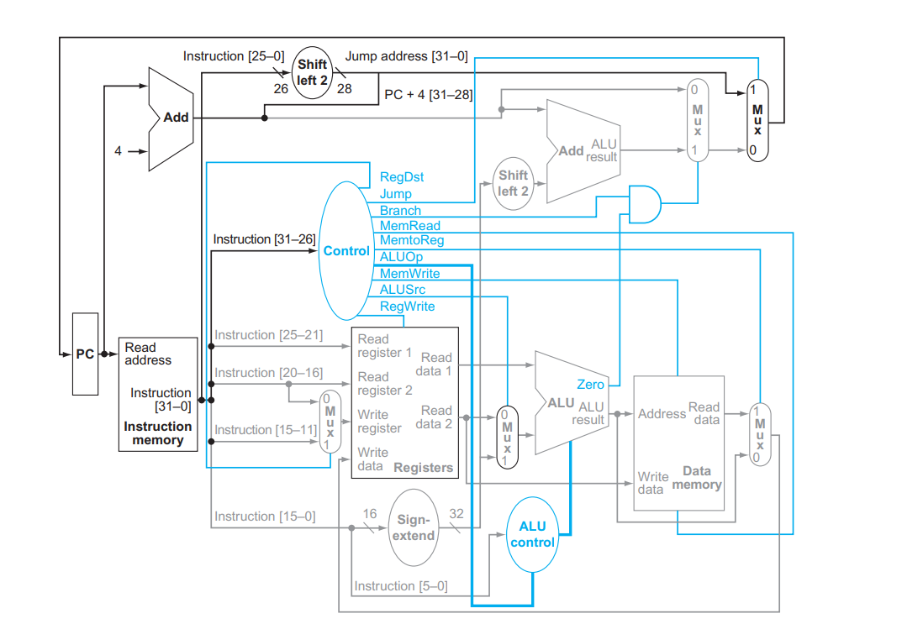

# CSE-BUBBLE Processor

The **CSE-BUBBLE Processor** is a custom-designed processor with a specific instruction set architecture (ISA). This repository contains the Verilog implementation of the processor, including the data path elements, finite state machine for control, and a single-cycle instruction execution unit. The processor's word size and instruction size are both 32 bits. 
#### For more details about implementation read report of the project present in this repository.

## Table of Contents
- [Introduction](#introduction)
- [Memory Organization](#memory-organization)
- [Processor Architecture](#processor-Architecture)
- [Usage](#usage)
- [Contributing](#contributing)

## Introduction
The CSE-BUBBLE Processor is developed to provide a platform for executing instructions based on the defined ISA. It consists of data path elements for operations like addition, subtraction, shifting, and jumping, as well as a finite state machine that controls the execution flow.

## Memory Organization
The memory in the CSE-BUBBLE Processor consists of two distinct parts: the **Instruction Memory** and the **Data Memory**. These two sections are organized to ensure there is no overlap.

## Processor Architecture

## Usage
1. Clone this repository to your local machine.
2. Use a Verilog simulator and synthesizer to compile and generate the processor design.
3. Initialize the Instruction Memory and Data Memory with appropriate values.
4. Simulate the processor's behavior using test benches for different instructions.

## Contributing
Contributions are welcome! If you find any issues or have suggestions for improvements, feel free to open an issue or create a pull request in this repository.

